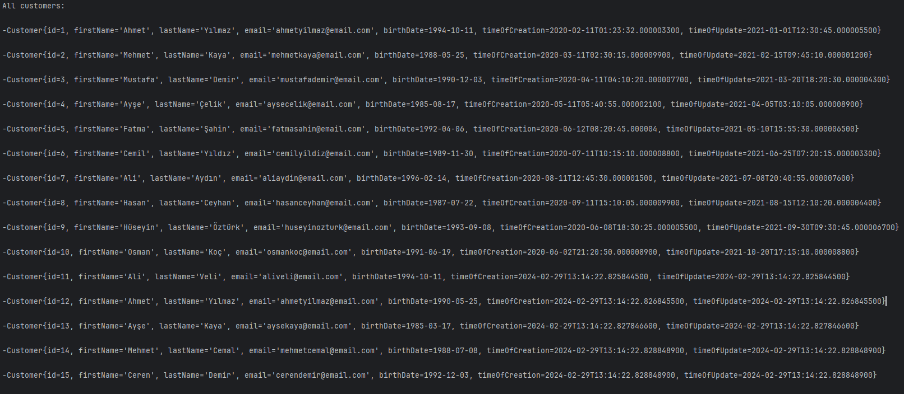
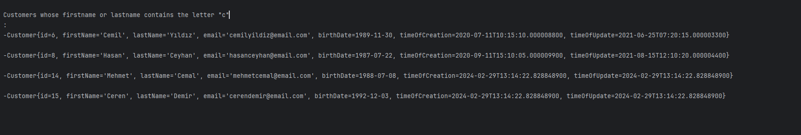
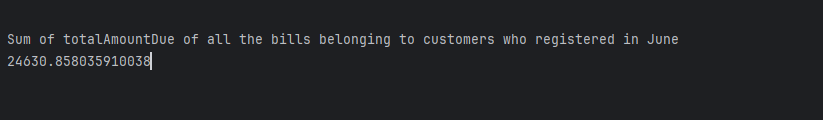
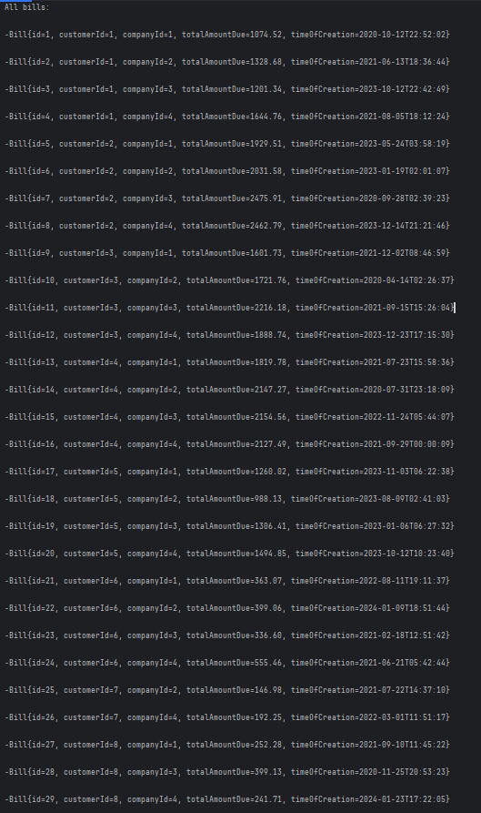
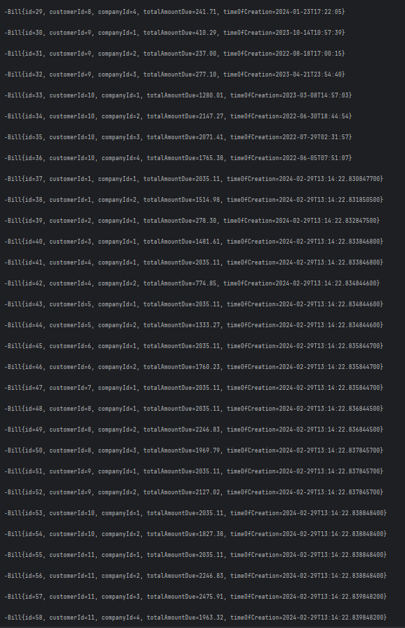
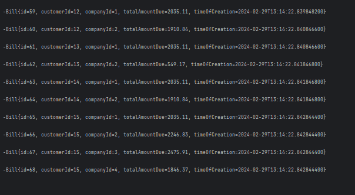
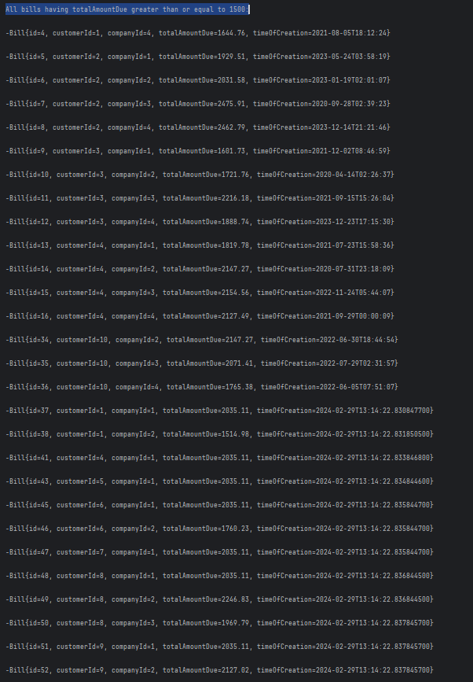
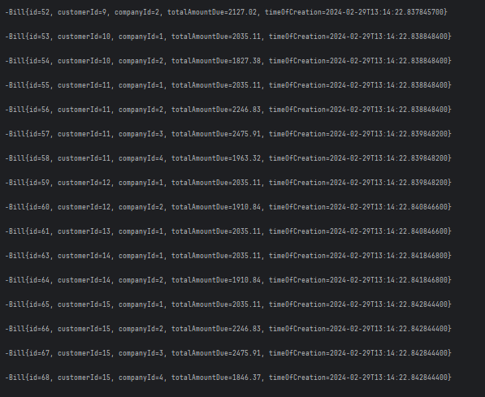
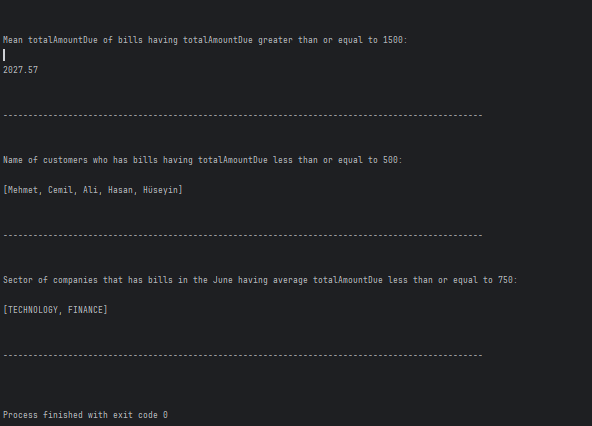

# About

System has Customer, Bill, Product, Company entities. There are respositories and services for each of the entities to facilitate basic crud operations.

## About DbConfig

This is where the initial data are created. Data are created in this file so that creation dates can be set randomly as a result we can have a set of data to query based on the month of creation 

### All Customers

### Customers Who Have Letter 'C' in their firstname or lastna alt="screenshot" me

### Sum of all bills' total amount belonging to customers who registered in June

### All bills in the system

### All bills 

### Rest of the logs

